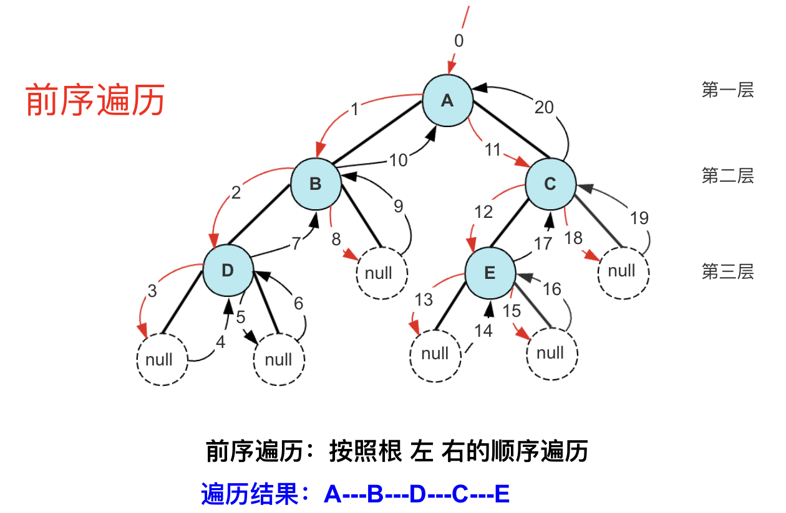
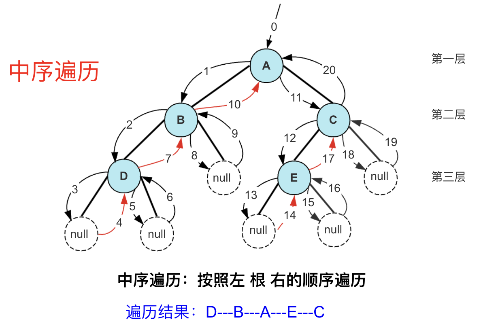
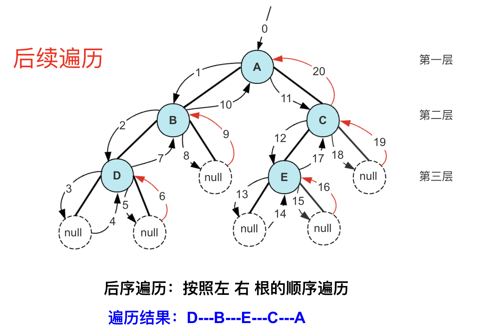
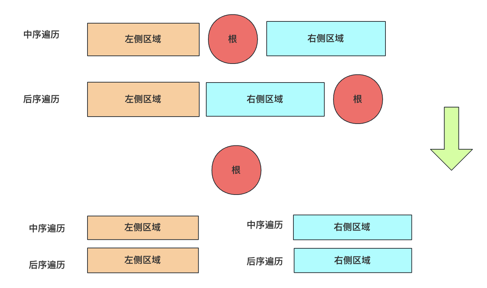

### 前言

大家好，我是bigsai，好久不见，甚是想念！

今天带大家征服二叉树的前中后序遍历，包含递归和非递归方式，学到就是赚到！

很多时候我们需要使用非递归的方式实现二叉树的遍历，非递归枚举相比递归方式的难度要高出一些，效率一般会高一些(及时停止)，并且前中后序枚举的难度呈一个递增的形式，非递归方式的枚举有人停在非递归后序，有人停在非递归中序，有人停在非递归前序(这就有点拉胯了啊兄弟)。

我们回顾递归，它底层其实是维护一个栈，将数据存到栈中，每次抛出栈顶的数据进行处理，编写递归的时候更重要的是掌握上下层之间的逻辑关系。

而非递归方式我们除了需要掌握上下层的逻辑关系之外，要手动的处理各种条件变更的细节， 递归是一个一来一回的过程，如果我们的逻辑只是在单趟的来或者回中还好，有时候甚至要自己维护来和回的状态，所以逻辑上难度还是比较大的。

### 二叉树的前序遍历

二叉树的前序遍历是最简单的，其枚举方式就是一个最简单的dfs，学会了二叉树的前序遍历，那么后面入门dfs就容易很多。

二叉树的前序遍历的枚举规则为：**根结点 ---> 左子树 ---> 右子树**，也就是给定一棵树，输出操作当前节点，然后枚举左子树(左子树依然按照根左右的顺序进行)，最后枚举右子树(右子树也按照根左右的顺序进行)，这样得到的一个枚举序列就是二叉树的前序遍历序列(也叫先序)。

前序遍历在二叉树树的顺序可以看下图(红色箭头指向的表示需要访问的，可以看出从父节点枚举下来第一次就要被访问)。



在具体实现的方式上，有递归方式和非递归方式实现。

#### 递归

递归方式实现的二叉树前序遍历很简单，递归我们只需要考虑初始情况、结束边界、中间正常点逻辑。

**初始情况**：从root根节点开始枚举，函数执行传入root根节点作为参数。

**结束边界**：节点为null那么就停止对应节点的递归执行。

**正常点逻辑**：先处理当前点(存储或输出)，递归调用枚举左子树，递归调用枚举右子树。

刚好力扣144二叉树的前序遍历可以尝试ac：

```java
class Solution {
    List<Integer> value = new ArrayList();

    public List<Integer> preorderTraversal(TreeNode root) {
        qianxu(root);
        return value;
    }

    private void qianxu(TreeNode node) {
        if (node == null) {
            return;
        }
        value.add(node.val);
        qianxu(node.left);
        qianxu(node.right);
    }
}
```

#### 非递归

非递归的前序还是非常简单的，前序遍历的规则是：**根节点，左节点，右节点**。

用栈将路过的节点先存储，第一次枚举节点输出储存然后放入栈中，第二次就是被抛出时候枚举其右侧节点。

**它的规则大致为**：

1. 一直访问当前节点并用栈存储，节点指向左节点，直到左孩子为null。

2. 抛出栈顶不访问。如果有右节点，访问其右节点重复步骤1，如有没右节点，继续重复步骤2抛出。

这样的一个逻辑，就会从根出发一直先往左访问，访问结束根、左之后再访问右节点(子树)，得到一个完成的前序遍历的序列。

具体实现的代码为：

```java
class Solution {
    public List<Integer> preorderTraversal(TreeNode root) {
        List<Integer> value = new ArrayList();
        Stack<TreeNode> q1 = new Stack();
        while (!q1.isEmpty() || root != null) {
            while (root != null) {
                value.add(root.val);//添加节点 等同输出
                q1.push(root);//入栈
                root = root.left;
            }
            root = q1.pop();//抛出
            root = root.right;//准备访问其右节点

        }
        return value;
    }
}
```


### 二叉树的中序遍历

二叉树的中序遍历出现的频率还是蛮高的，尤其是二叉排序树相关问题还是蛮多的，你要知道二叉排序树的中序遍历是一个**有序的序列**，如果求二叉排序树的topk问题，非递归中序那效率是非常高的。

中序遍历在二叉树树的顺序可以看下图(红色箭头指向的表示需要访问的，可以看出如果子树为null，那肯定要访问，否则就是**从左子树回来的时候**才访问这个节点)。



#### 递归方式

递归方式实现很简单，其逻辑和前序递归相似的，力扣94刚好有二叉树中序遍历,这里我直接放代码：

```java
class Solution {
   public List<Integer> inorderTraversal(TreeNode root) {
	  List<Integer>value=new ArrayList<Integer>();
	  zhongxu(root,value);
	  return value;
  }
	 private void zhongxu(TreeNode root, List<Integer> value) {
		 if(root==null)
			 return;
		 zhongxu(root.left, value);
		 value.add(root.val);
		 zhongxu(root.right, value);
	}
}
```

#### 非递归方式

非递归的中序和前序是非常相似的，前序遍历的规则是：**根节点，左节点，右节点**。中序遍历的顺序是**左节点，根节点，右节点** ，其实看了上面图就很好理解：访问完左侧然后回来时候再访问当前节点，这其实就是对应栈抛出节点的时候访问。

**它的规则大致为**：

1. 枚举当前节点(不存储输出)并用栈存储，节点指向左节点，直到左孩子为null。

2. 抛出栈顶访问。如果有右节点，访问其右节点重复步骤1，如有没右节点，继续重复步骤2抛出。

这样的一个逻辑，就会形成一个中序序列，因为叶子节点的左右都为null，这样的规则依然满足中序。

实现代码为：

```java
class Solution {
   public List<Integer> inorderTraversal(TreeNode root) {
		List<Integer>value=new ArrayList<Integer>();
    Stack<TreeNode> q1 = new Stack();	
    while(!q1.isEmpty()||root!=null)
    {
        while (root!=null) {
            q1.push(root);				
            root=root.left;
        }
        root=q1.pop();//抛出
        value.add(root.val);
        root=root.right;//准备访问其右节点
        
    }
    return value;
  }
}
```


### 二叉树的后序遍历

二叉树的后序遍历非递归方式实现起来难度最大的，能够手写非递归后序，一定能亮瞎面试官的眼！

后序遍历在二叉树树的顺序可以看下图(红色箭头指向的表示需要访问的，就是**从右子树回来的时候**才访问这个节点)。



#### 递归

二叉树递归方式后序遍历很简单，跟前序中序的逻辑一样，在力扣145有后序的code测试大家可以自己尝试一下。

这里直接放我写的后序递归方式：

```java
class Solution {
    List<Integer>value=new ArrayList<>();
    public List<Integer> postorderTraversal(TreeNode root) {
        houxu(root);
        return value;
    }
    private void houxu(TreeNode root) {
        if(root==null)
            return;
        houxu(root.left);
        houxu(root.right);//右子树回来
        value.add(root.val);
    }
}
```

#### 非递归

非递归的后序就稍微难一点了，你会发现：卧槽，为啥前面的方法没法用了？

你看下前序遍历和中序遍历有啥相似的地方：一个是左孩子去的时候访问，一个是左孩子回来的时候才访问，都在左孩子来回访问的，访问右孩子时候自己被第一次回来pop释放掉了！

所以该怎么办呢？第一次左孩子回来的时候不释放当前节点，继续放在栈里面，等右孩子回来访问再释放。

但是这就有个疑问，pop访问到当前节点，到底是左孩子来的还是右孩子来的呢？

两个解决思路：

**第一个**用hashmap 记录节点访问次数，如果是1那么就继续放这，如果是2那么就表示要访问抛出了，这种方法有点low。

思路理解了，怎么实现呢？最简单的就是使用一个hashmap存储节点访问次数。

附一下个人实现的代码：

```java
class Solution {
    public List<Integer> postorderTraversal(TreeNode root) {
        List<Integer> value=new ArrayList();
        Stack<TreeNode> q1 = new Stack();	
        Map<TreeNode,Integer >map=new HashMap<>();
        while(!q1.isEmpty()||root!=null)
        {
            if (root!=null) {
                q1.push(root);
                map.put(root, 1); //t.value标记这个值节点出现的次数
                root=root.left;
            }
            else {
                root=q1.peek();
                if(map.get(root)==2) {//第二次访问，抛出
                    q1.pop();
                    value.add(root.val);
                    root=null;//需要往上走
                }
                else {
                    map.put(root, 2);
                    root=root.right;
                }     
            }
          }
          return value;
    }
}
```

但是这个情况如果面试官问你如果有hash冲突怎么办？虽然这种概率非常小几乎不会但是面试官不会放过你，但是还是要用正统方法来实现。

那么第二个正统方法怎么解决呢？

也很容易，用一个pre节点一直保存上一次抛出访问的点，如果**当前被抛出的右孩子是pre或者当前节点右为null**，那么就将这个点抛出，否则就将它"回炉重造"一次！

实现代码为：

```java
class Solution {
    public List<Integer> postorderTraversal(TreeNode root) {
        TreeNode temp=root;//枚举的临时节点
        List<Integer>value=new ArrayList<>();
        TreeNode pre=null;//前置节点
        Stack<TreeNode>stack=new Stack<>();

        while (!stack.isEmpty()||temp!=null){
            while(temp!=null){
                stack.push(temp);
                temp=temp.left;
            }
            temp=stack.pop();
            if(temp.right==pre||temp.right==null){//需要弹出
                value.add(temp.val);
                pre=temp;
                temp=null;//需要重新从栈中抛出
            }else{
                stack.push(temp);
                temp=temp.right;
            }
            
        }
        return value;
    }
}
```


是不是觉得非常巧妙？那我再说一种骚操作的代码，你看 **左右中**，它反过来就是**中右左**，这不就是一个反的前序遍历嘛！所以进行一次反的前序遍历，然后将结果翻转一下也能得到这个值啦，当然，你使用双栈同时翻转也是一样的道理！

实现代码为：

```java
class Solution {
    public List<Integer> postorderTraversal(TreeNode root) {
      List<Integer>value=new ArrayList();
      Stack<TreeNode> q1 = new Stack();	
      while(!q1.isEmpty()||root!=null)
      {
        while (root!=null) {
          value.add(root.val);
          q1.push(root);				
          root=root.right;
        }
        root=q1.pop();//抛出
        root=root.left;//准备访问其右节点
      }
      Collections.reverse(value);//将结果翻转
      return value;

     
    }
}
```


### 给两个序列如何构造一棵二叉树

经常会遇到给两个序列确定一个二叉树，当然这个序列其中之一**必须包含中序遍历序列**。前序、中序确定二叉树和后序、中序确定一个二叉树的原理一致。

#### 前序中序确定一棵二叉树

根据一棵树的前序遍历与中序遍历构造二叉树。当然也是[力扣105的原题](https://leetcode-cn.com/problems/construct-binary-tree-from-preorder-and-inorder-traversal/)。

注意:你可以假设**树中没有重复的元素**。

**分析：**
给定一个前序序列和一个中序序列，且里面没有重复的元素，如何构造一和二叉树呢？我们可以先单独观察两个序列的特征：

**前序遍历**：遍历规则为(根，[左侧区域]，[右侧区域])。
**中序遍历**：遍历规则为([左侧区域]，根，[右侧区域])。

其中前序遍历的左侧区域和中序遍历的左侧区域包含元素的范围相同，根也是相同的。所以可以进行这样的操作：
1. 根据前序遍历的第一个找到根节点，可以**确定根**。
 2. 通过中序遍历找到根节点的值，这样可以知道左侧区域和右侧区域节点个数多少。
 3. 根节点左侧区域由前中序列确定的左侧区域确定，根节点的右侧节点由前中序序列的右侧区域确定。

一些操作可以借助这张图进行理解：


具体的实现上，可以使用一个HashMap存储中序存储的序列，避免重复计算。实现的代码为：

```java
/**
 * Definition for a binary tree node.
 * public class TreeNode {
 *     int val;
 *     TreeNode left;
 *     TreeNode right;
 *     TreeNode(int x) { val = x; }
 * }
 */
class Solution {
   public TreeNode buildTree(int[] preorder, int[] inorder) {
		if(preorder.length==0)
			return null;
		TreeNode root=new TreeNode(preorder[0]);
		Map<Integer, Integer>map=new HashMap<Integer, Integer>();
		for(int i=0;i<inorder.length;i++)
		{
			map.put(inorder[i], i);
		}
		return buildTree(preorder,0,preorder.length-1, map,0,inorder.length-1);
    }

	private TreeNode buildTree(int[] preorder, int preStart, int preEnd, Map<Integer, Integer> map, int inStart, int inEnd) {
		// TODO Auto-generated method stub
		if(preEnd<preStart||inEnd<inStart)
			return null;
		TreeNode node=new TreeNode(preorder[preStart]);
		int i=map.get(preorder[preStart]);//节点的值
		
		int leftlen=i-inStart;//左面的长度
		node.left=buildTree(preorder, preStart+1, preStart+1+leftlen, map, inStart, i-1);
		node.right=buildTree(preorder, preStart+leftlen+1,preEnd, map, i+1, inEnd);
		return node;		
	}
}
```
#### 中序后序确定一个二叉树

根据一棵树的中序遍历与后序遍历构造二叉树，[力扣106题](https://leetcode-cn.com/problems/construct-binary-tree-from-inorder-and-postorder-traversal/)

注意:你可以假设树中没有重复的元素。

例如，给出
>中序遍历 inorder = [9,3,15,20,7]
>后序遍历 postorder = [9,15,7,20,3]

返回如下的二叉树：
```
    3
   / \
  9  20
    /  \
   15   7
```
**分析：**
有了上面的分析，那么通过一个后序遍历和中序遍历去构造一棵二叉树，其实原理和前面的也是一样的。

**后序遍历**：遍历规则为([左侧区域]，[右侧区域]，根)。
**中序遍历**：遍历规则为([左侧区域]，根，[右侧区域])。

然后递归构造就可以了！




具体实现的代码为：

```java
/**
 * Definition for a binary tree node.
 * public class TreeNode {
 *     int val;
 *     TreeNode left;
 *     TreeNode right;
 *     TreeNode(int x) { val = x; }
 * }
 */
class Solution {
   public TreeNode buildTree(int[] inorder,int[] postorder) {
		if(postorder.length==0)
			return null;
		Map<Integer, Integer>map=new HashMap<Integer, Integer>();
		for(int i=0;i<inorder.length;i++)
		{
			map.put(inorder[i], i);
		}
		return buildTree(postorder,0,postorder.length-1, map,0,inorder.length-1);
    }

	private TreeNode buildTree(int[] postorder, int postStart, int postEnd, Map<Integer, Integer> map, int inStart, int inEnd) {
		// TODO Auto-generated method stub
		if(postEnd<postStart||inEnd<inStart)
			return null;
		TreeNode node=new TreeNode(postorder[postEnd]);
		int i=map.get(postorder[postEnd])；
		int leftlen=i-inStart;
		node.left=buildTree(postorder, postStart,postStart+leftlen-1, map, inStart, i-1);
		node.right=buildTree(postorder, postStart+leftlen,postEnd-1, map, i+1, inEnd);          
    return node;		
	}
}
```

### 结语

好了，今天到这里就先介绍完了，但二叉树的内容远不止于此，还有非常牛批的Morris遍历，以及一些二叉树骚操作技巧常考问题后面还会慢慢总结分享给大家。

