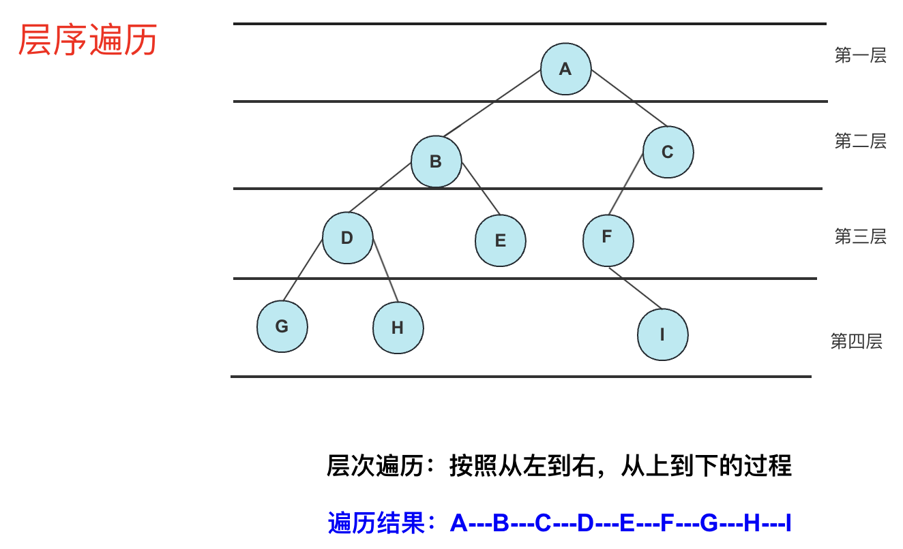
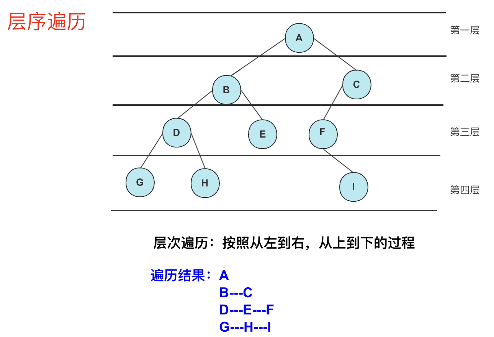
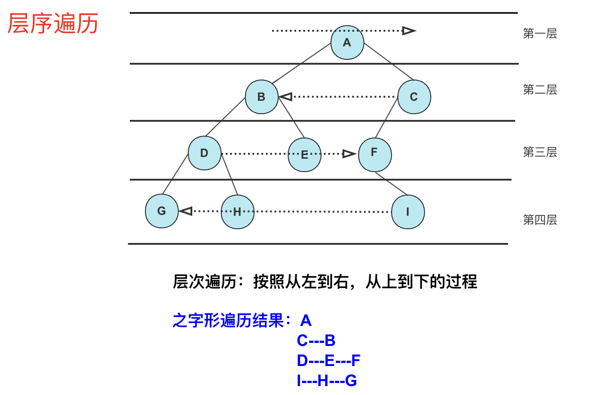

### 前言

在数据结构与算法中，二叉树是一个无论在考研还是笔试中都极为常见的考点。在二叉树的系列问题中，对其进行遍历是至关重要的，而其中层序遍历是一个尤为重要的知识点。今天重点分享关于二叉树层序遍历的内容。

二叉树层序遍历是广度优先搜索（BFS）的最简单应用之一，我将在这里分享关于二叉树层序遍历以及常见问题的一些经验和知识。

在深入探讨二叉树的遍历之前，我们需要掌握一些关键的数据结构与算法知识，包括队列、递归、栈以及二叉树。这些内容在之前的学习中已经涉及，如果有同学在这些方面存在一些知识欠缺，建议回顾一下相关内容。这将为理解后续的层序遍历及问题解答提供必要的基础。

### 层序遍历




层序遍历，听名字也知道是按层遍历。一个节点有左右孩子节点，按层处理就是当前层兄弟节点的优先级要大于子节点处理的优先级，所以就是要将子节点放到后面处理，这就适合队列这个数据结构用来存储。

对于队列，先进先出。从root节点push到队列，那么队列中先出来的顺序是第二层的左右节点(假设都有)，第二层每个节点执行的时候按照左右顺序添加到队列，第三层的节点就会有序的放到最后面……按照这样的规则就能得到一个层序遍历的顺序。

实现的代码也很容易理解：

```java
public int[] levelOrder(TreeNode root) {
    int arr[] = new int[10000];
    int index = 0;
    Queue<TreeNode> queue = new ArrayDeque<>();
    if (root != null) {
        queue.add(root);
    }
    while (!queue.isEmpty()) {
        TreeNode node = queue.poll();
        arr[index++] = node.val;
        if (node.left != null)
            queue.add(node.left);
        if (node.right != null)
            queue.add(node.right);
    }
    return Arrays.copyOf(arr, index);
}
```


### 分层存储

但是在具体笔试他可能要求你分层存储，例如力扣的102二叉树的层序遍历，要求返回一个`List<List<Integer>>`类型。



这种相比上面一个多了一层逻辑就是每一层数据放到一块，这个也很容易，最好想到的就是两个队列(容器)一层一层遍历存储，然后交替，但是两个队列(容器)的写法常常会被面试官嫌弃，很多面试官让你想想怎么不用两个容器实现？

不用双队列去枚举结果也很容易，重要的就是先记录队列大小size(当前层节点数量)，然后执行size次数的枚举即可，具体代码为：

```java
public List<List<Integer>> levelOrder(TreeNode root) {
    List<List<Integer>>list=new ArrayList<List<Integer>>();
    if(root==null)return list;
    Queue<TreeNode> q1=new ArrayDeque<TreeNode>();
    q1.add(root);
    while (!q1.isEmpty()) {
        int size=q1.size();
        List<Integer>value=new ArrayList<Integer>();
        for(int i=0;i<size;i++)
        {
            TreeNode pNode=q1.poll();
            if(pNode.left!=null)
                q1.add(pNode.left);
            if(pNode.right!=null)
                q1.add(pNode.right);
            value.add(pNode.val);
        }
        list.add(value);
    }
    return list;
}
```

### 之字形打印

除了这个直接层序遍历，二叉树还有很高频的就是之字形遍历，例如剑指offer32和力扣103 二叉树的锯齿形层序遍历，它的题目要求为：

> 请实现一个函数按照之字形顺序打印二叉树，即第一行按照从左到右的顺序打印，第二层按照从右到左的顺序打印，第三行再按照从左到右的顺序打印，其他行以此类推。

这道题虽然不是难题，但是有点绕，本来队列这玩意我们就要大脑想一下什么顺序，又出来一个之字形，属实增加的思维逻辑，有不少小伙伴反映当时面试官让手撕这道题，自己以前明明写过，但是太紧张自己给自己绕进去了！



其实这个问题也很容易转化，因为值只是存储，我们按照老样子去进行层序遍历，只不过在遍历时候通过当前层奇偶数来给它判断是从左往右存储到结果中还是从右往左放到结果中。当然，判断奇数偶数也很容易，可以用变量，也可以用结果List的size()都可。

个人实现的一个朴素代码为：

```java
public List<List<Integer>> levelOrder(TreeNode root) {
    List<List<Integer>> value = new ArrayList<>();//存储到的最终结果
    if (root == null)
        return value;
    int index = 0;//判断
    Queue<TreeNode> queue = new ArrayDeque<>();
    queue.add(root);
    while (!queue.isEmpty()) {
        List<Integer> va = new ArrayList<>();//临时 用于存储到value中
        int len = queue.size();//当前层的数量
        for (int i = 0; i < len; i++) {
            TreeNode node = queue.poll();
            if (index % 2 == 0) {
                va.add(node.val);
            } else {
                va.add(0, node.val);
            }
            if (node.left != null) {
                queue.add(node.left);
            }
            if (node.right != null) {
                queue.add(node.right);
            }
        }
        value.add(va);
        index++;
    }
    return value;
}
```

上面实现代码也仅使用一个队列，不过这个问题可能有很多更巧妙的解法需要大家自己去挖掘。

### 结语

二叉树的层序遍历是二叉树内容中较为简单的内容，但是层序遍历尤其是之字形遍历(锯齿形遍历)出现的频率真的太高了，并且最好是掌握比较好的方法不要显得太臃肿。

不过在实际遇到问题时候，能AC是第一位，然后才是精简的逻辑和骚气的代码。

二叉树层序遍历变种问题不多，掌握上面三个问题基本就够了，而二叉树的前序、中序、后序遍历(递归非递归)考察非常多，后面会给大家加快梳理总结，敬请期待！


