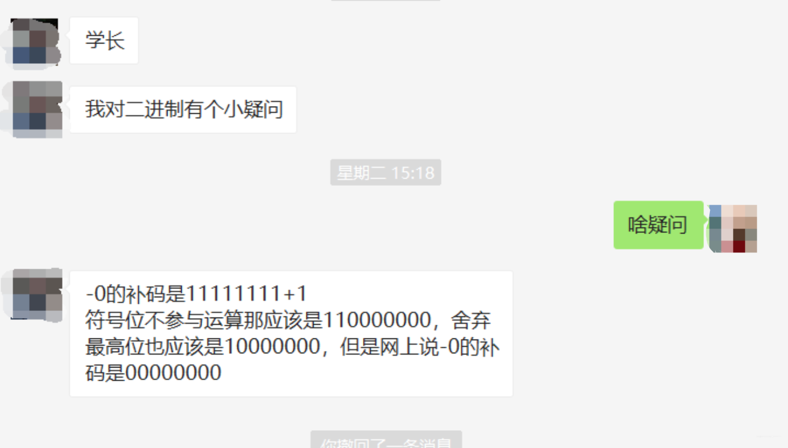
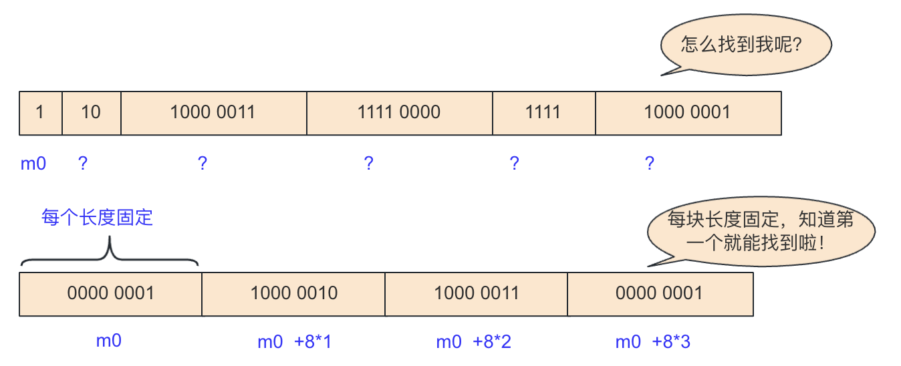
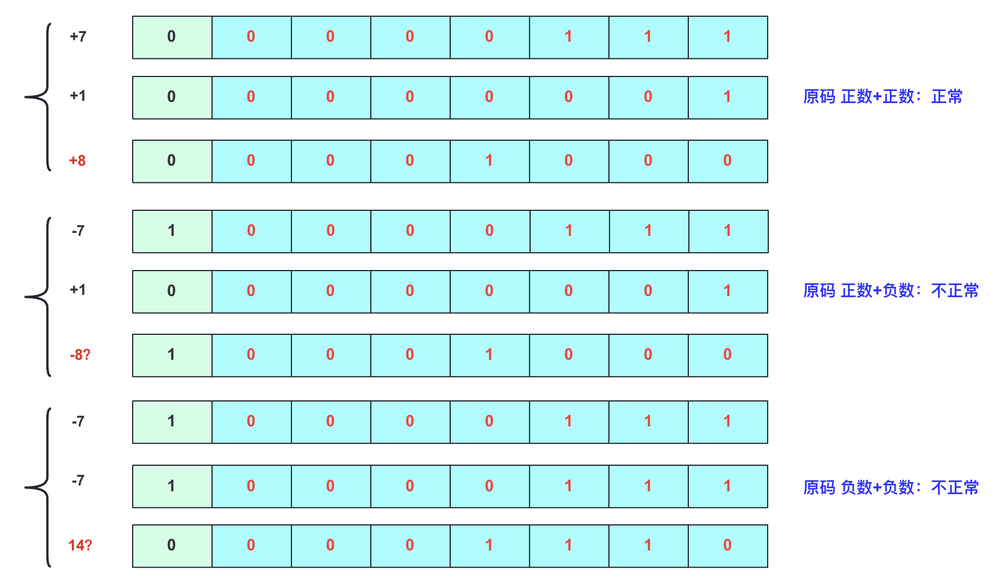
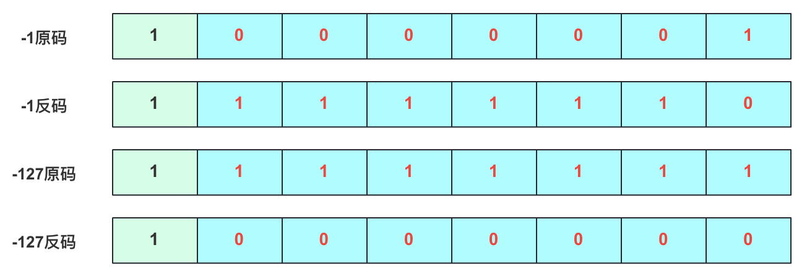
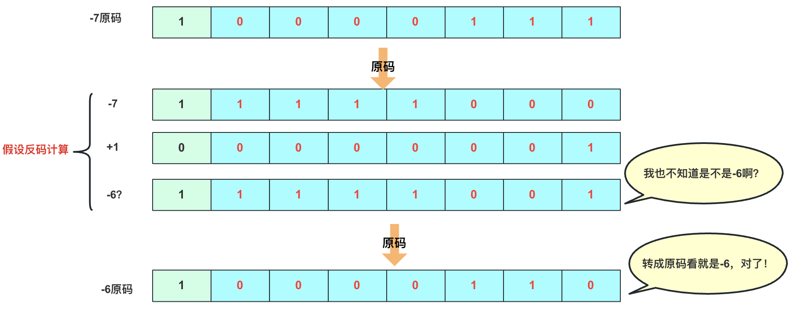
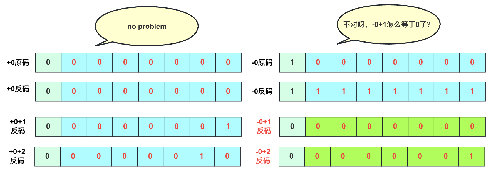
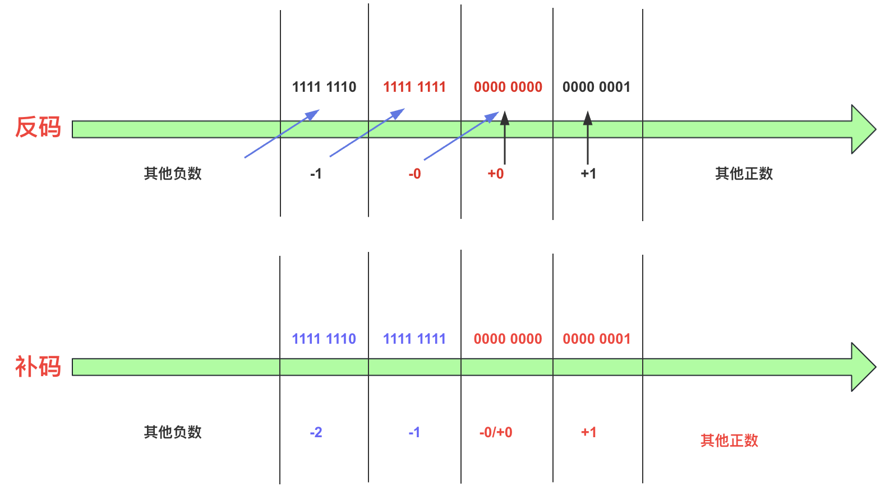
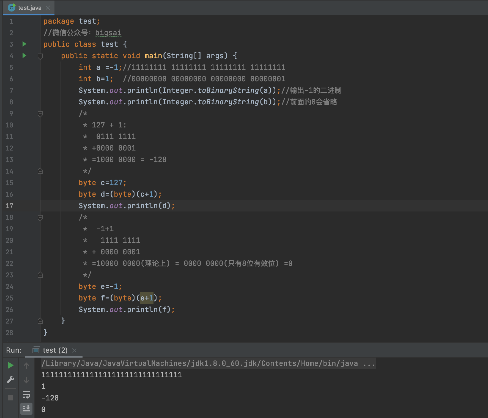

### 前言

**补码是给机器看的，原码是给人看的，反码是二者的桥梁**，原码反码补码虽然是简单问题，但确实很多人很长时间没有搞明白和深入思考，这篇把自己学习和理解过程记录下来，本篇是**20年**刚考上研的暑假一个学弟遇到的问题，当时研究了一下。

故事是一个真实的故事，前两天要被一位学弟折磨死，原码、反码、补码不懂就算了，讲了一遍还不懂。


我搞不懂是二进制太难还是我太难了呢？你们不信？立图为证：



他这问的给我直接问懵逼了，二进制符号位不参与运算？我怎么听得给我都听糊涂了，哈哈哈，后来我就给他说了要参加运算，再后来又一个问题：


他这么确定的眼神给我搞得都有点懵逼，都吓得我打一段代码去验证一下结果没毛病，又巴拉巴拉给他讲了一通。

我觉得应该可以了吧，结果在凌晨1.30的时候……


算了，算了，这孩子没得救了，不管了，得让他静静……我也得静静，梳理一下自己曾在原码、反码、补码上的困惑。
- 记得刚学C++的时候：这啥玩意代码不要求，不学……
- 学操作系统、组成原理的时候：enumm，跳过跳过……
- 考研时候：会而不深刻，没仔细思考……

所以以前的我也一直没能搞懂二进制，并且很排斥二进制，总感觉它没用还又烧脑。

但事实上二进制这个知识是无论如何也避免不了的知识点。想着要拯救更多苦于二进制或者说原码反码补码的小学弟小学妹们，我得站出来做点什么，**学弟妹直呼内行！**


### 二进制数字

什么是二进制？

其实二进制的01就是对应数字电路中的关开，所以在整个计算机中所有的东西都是二进制科学，但我们只需要研究数字类型的二进制其规则原理的，数字本身最直接的就是二进制。

如果说不谈啥原码、反码、补码，光光看二进制跟十进制的关系，也不考虑位数，我想大部分人可以搞得懂。
- 比如2的二进制：`10`，3的二进制：`11`，4的二进制：`100`，5的二进制：`101`.

负数的二进制怎么搞？

- -2二进制`-10`？-3二进制`-11`?这样不太妥吧，怎么跟着这么一个负数？

另外，这种不确定长度的二进制如果是一个数组我该怎么在计算机内存中找的到？所以数值的二进制相同类型它的长度其实是固定的，以一个可能不太恰当的图展示一下：



计算机数值类型设计之初就明确表示：**计算机基本数据是定长的，并且有两部分组成:符号位(一位)和数值位(若干位)**，其中符号位的0或者1分别表示正和负数，而数值位就是表示数据的大小。

你可能直呼：到底多少位表示一个数字呢？如果太长位数据如果很小(前面都是0)就会造成浪费，造成内存浪费，而位数太短又会导致装不下，网友们直呼真难。

伟大的设计者们当然考虑了这个问题，他们将数值二进制的长度分为不同长度供你使用，在Java中有这8种基本数据类型(1byte=8bit)：

| 基本类型 | 长度(byte) | 包装类型  | 取值范围                                                     |
| -------- | ---------- | --------- | ------------------------------------------------------------ |
| byte     | 1          | Byte      | -128~127                                                     |
| short    | 2          | Short     | -32768 ～ 32767                                              |
| int      | 4          | Integer   | -2147483648～2147483647                                      |
| long     | 8          | Long      | -9223372036854774808～9223372036854774807                    |
| float    | 4          | Float     | 3.402823e+38～1.401298e-45（e+38 表示乘以10的38次方，而e-45 表示乘以10的负45次方） |
| double   | 8          | Double    | 1.797693e+308～4.9000000e-324                                |
| char     | 2          | Character |                                                              |
| boolean  | 官方未确定 | Boolean   | true  false                                                  |

比如说你有个byte a=1，它在内存中就是这样的：
>0000 0001

如果你有个 int b=1，因为int是32位，那么它在内存中是这样存的：
>00000000 00000000 00000000 00000001

你可能会问为啥没讲负数？

别急慢慢来，下面原码、反码、补码讲着呢。另外需要注意的是，**二进制进行加法如果溢出，溢出部分不会记录，只会保存有效部分**，所以选用什么数据类型也要掂量目标数据的大小范围。

### 原码

上面既然初步知道了二进制数字的一些规律，那么就让它来的更猛烈一些吧，先搞懂原码！

原码就是二进制的初始表示符号位，即最高位为符号位：正数该位为0，负数该位为1（0有两种表示：+0和-0），其余位表示数值的大小。


是不是很直接明了的展示一个值？原码的优势就是**比较明显的表示一个值**，能够清楚的知道这个二进制数表示是多少，简单直观。

但使用原码是否就可以畅通无阻了呢？

当然不可以，原码虽然可以很容易的表示一个正负数，但是我们观察它的加法：



正数相加没问题，但是负数的加法就出问题了：

负数的加法只考虑绝对值数值的增加而未考虑负数的特性。并且存在负数加负数的会变成正数问题，所以原码在负数的加法成了一个难题，走不通。

### 反码

负数的原码无法实现加法，因为原码如果进行加法实现的是与符号无关**数值绝对值的加法**。所以这点和负数的加法规则矛盾，并且计算机也只会加法。咱们只能另从它计。

此时，有些伟大的大佬就发现了反码这个东西，而反码的定义是这样的：**正数的反码与其原码相同；负数的反码是对除符号位逐位取反，符号位保持为1.** 因为负数原码的加法是相反的(即加一变成减一的操作)，给负数原码中的数字01颠倒那么这个数字加法有可能就正了(留下悬念)。

反码有个缺点就是负数不好看大小，可以看下面-1和-127的原码反码比较。



转换后的数字进行加法(正数)运算，在进行01互换之后可以**进行正常加法的逻辑**。



负数相加好像看起来也没问题，但是真的就可以了嘛？正数负数用反码表示可以畅通无阻了？

no no no。咱们记得原码中有+0，-0，但是不影响操作，看看反码中+0，-0的情况：



你看看，反码它也不行啊，有两个0，what should I do？看下面的补码分析。

### 补码

反码为啥会出现这个问题呢？主要是正负0占了两个坑：


也就是如果你用反码表示这个数，用它进行加法运算，正数范围内玩没问题，负数范围内玩也没问题，但是**当你从负数迈到正数的时候会经过两个0**(-0，+0)两个零重复表示了。

这该如何表示呢？我们看看这些数字反码的规律：
>**-3的反码： 1111  1100
>-2的反码： 1111  1101
>-1的反码： 1111  1110
>-0的反码： 1111  1111**
>+0的反码：0000 0000

这些负数的反码，如果都能加个1，那么这样正负0的矛盾不久不存在了嘛？！这就是所谓的补码：**符号位不变，正数的补码为和原码、反码一致，负数的补码为其反码加1.**



这样我们就解决了所有难题，叱咤风云的进行计算了，其实在计算机中二进制也是用补码表示所有数值。

对于补码，确实有点难直接看出它是多少，负数理解起来可能还有那么一点点抽象，我们该如何理解补码呢？
我是这么理解的：二进制数把数据分为正负两个部分，分别表示两个区间：


什么意思呢？这个也就是说你可以把**负数看成一部分，正数看成一部分**。而每个部分的数值分布也是相同的：无论负数还是正数出去符号位，都是从 000 0000~111 1111(byte为例)分布。如果前面符号位为1就是表示负数，负数的最小到最大(-128 ~ -1)共128个，如果是0就是正数的最小和最大(0 ~ 127)共128个。这样理解是不是容易很多呢！

### 测试

上面讲了那么多道理，咱们测试一下吧，用以下代码验证上述结果

```java
//微信公众号：bigsai
public class Main {
	public static void main(String[] args) {
		int a =-1;//11111111 11111111 11111111 11111111
		int b=1;  //00000000 00000000 00000000 00000001
		System.out.println(Integer.toBinaryString(a));//输出-1的二进制
		System.out.println(Integer.toBinaryString(b));//前面的0会省略
		
		/*
		 * 127 + 1:
		 *  0111 1111
		 * +0000 0001
		 * =1000 0000 = -128
		 */
		byte c=127;
		byte d=(byte)(c+1);
		System.out.println(d);
		
		/*
		 *  -1+1
		 *   1111 1111
		 * + 0000 0001
		 * =10000 0000(理论上) = 0000 0000(只有8位有效位) =0
		 */
		byte e=-1;
		byte f=(byte)(e+1);
		System.out.println(f);
	}
}

```
输出结果：




### 总结

到此，是不是对原码、反码、补码理解更透彻一点了呢？快点发给你大一的学弟妹看看他会不会！总结一下：

**原码：人类的视角** 

能够直接的显示数值的大小状况，结构为符号位+数值部分，符号位0代表正，1代表负。

**反码：寻找机器语言的对话桥梁**

是一个过渡码，其实就是在求补码或者原码补码转换过程中需要用到。反码规则是正数反码等于原码，负数反码符号位不变，数值位0变成1，1变成0.

**补码：机器的语言**

计算机中数值都是以补码的形式进行计算的，它有效的解决负数加法问题，也可以**使符号位直接参与运算**。

原码、反码、补码转换很简单，通过本篇应该可以理解二进制原码、反码、补码了。

