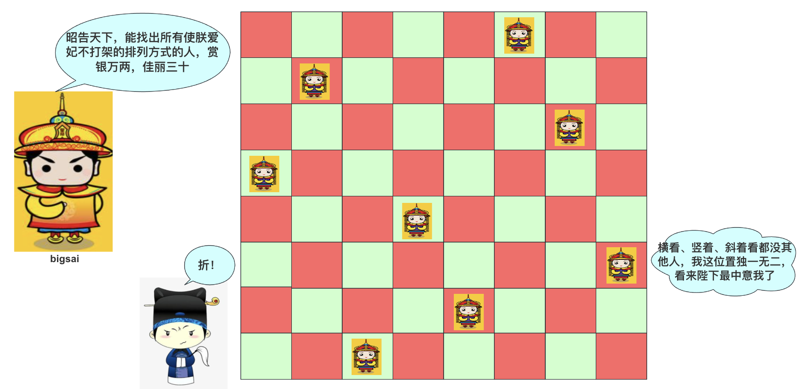
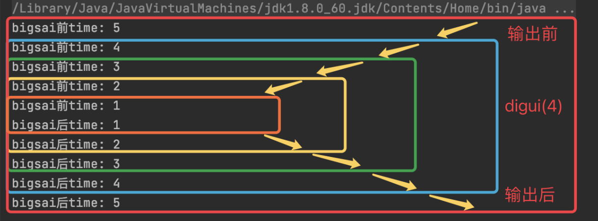
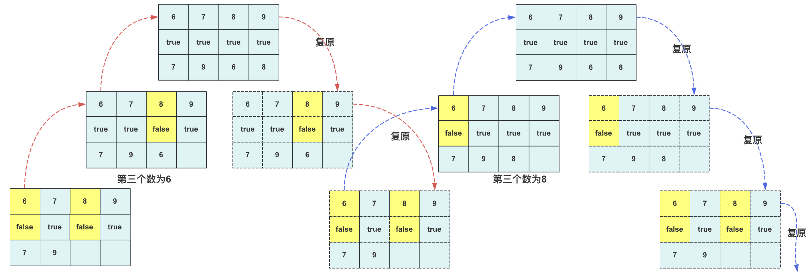
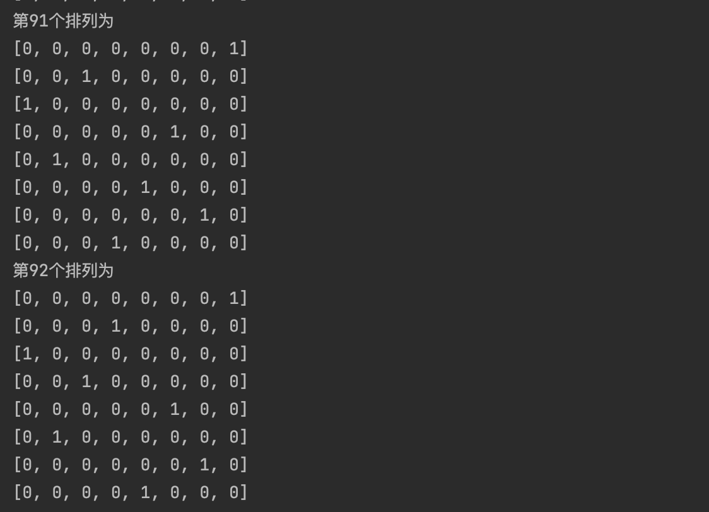

### 前言
提到回溯算法问题，就不得不联想到八皇后问题，很有可能是在学习数据结构或算法课程中遇到的最具挑战性的一道题目。


第一次遇到它的时候应该是大一下或者大二这个期间，这个时间对啥都懵懵懂懂，啥都想学却发现好像啥都挺难的，八皇后同样把那个时候的我阻拦在外，我记得很清楚当时大二初我们学业导师给我们开班会时候讲到的一句话很清晰："如果没有认真的学习算法他怎么可能解出八皇后的代码呢"。

确实如此，那个时候的我搞不懂递归，回溯也没听过，连Java的基础集合都没用明白，毫无逻辑可言，八皇后对我来说确实就是无从下手。

但今天，可以吊打八皇后了，首先搞清楚八皇后问题：



假设你是个皇帝，有八个妃子，要将**各个妃子充分隔离**(横着看不到、竖着看不到、斜着看不到)，这个很难去一下子有什么比较好的方式去执行，只能通过不断地**试探、还原**尝试，这就是所谓的回溯法。


### 浅谈递归
对于递归算法，我觉得**掌握递归是入门数据结构与算法的关键**，因为后面学习很多操作涉及到递归，例如链表的一些操作、树的遍历和一些操作、图的dfs、快排、归并排序等等。


递归的实质还是借助栈实现一些操作，利用递归能够完成的操作使用栈都能够完成，并且利用栈的话可以很好的控制停止，效率更高(递归是一个来回的过程回来的时候需要特判)。

递归实现和栈实现操作的区别，递归对我们来说更简洁巧妙，并且用多了会发现很多问题的处理上递归的思考方式更偏向人的思考方式，而栈的话就是老老实实用计算机(数据结构特性)的思维去思考问题，这个你可以参考二叉树的遍历方式递归和非递归版本，复杂性一目了然。

从递归算法的特征上来看，递归算法的问题都是**父问题可以用过一定关系转化为子问题**。即从后往前推导的过程，一般通过一个参数来表示当前的层级，通常是自己调用自己，层级之间有参数的差异。



通常递归算法的一个流程大致为：

```
定义递归算法及参数
- 停止递归算法条件
- (可存在)其他逻辑
- 递归调用(参数需要改变)
- (可存在)其他逻辑
```


### 回溯算法
谈完递归，你可能明白有这么一种方法可以使用，但你可能感觉单单的递归和八皇后还是很难扯上关系，是的没错，所以我来讲回溯算法了。

这里插个小插曲，前天(20年初)有个舍友我们宿舍一起聊天的时候谈到回溯算法，他说回shuo(朔)算法，我们差异的纠正了一下是回su(素)算法，他竟然读错了四年……不知道路过的你们有没有读错的。


算法领域有五种常用算法：贪心算法、分治算法、动态规划算法、回溯算法以及分支界限算法。回溯算法是这五种算法中的一员，因为它在解决许多实际问题时表现出色。尽管在很多情况下复杂度可能相对较高，但大多数情况下都能够获得令人满意的结果。

回溯法的核心思想是**试探和复原**。这一自动化的过程通过递归来实现，在递归函数执行前进行尝试修改，满足条件后进行向下递归试探，试探完成后需要将数值复原。在这个试探的过程中，找到我们需要的一个或多个解，这个过程通常被俗称为暴力搜索。

还不理解？好的，那我再解释一下。你应该听说过深度优先搜索（DFS），**实际上，回溯算法就是一种特殊的DFS**。之所以称之为回溯，是因为这类算法在运用递归时都包含一个复原的过程，前面的操作就好比是在试探。这类算法通常会搭配一个或多个布尔类型的数组，用于标记在试探过程中已经使用过的点。

举个例子，我们知道回溯算法用来求所有数字的排列顺序。我们分析其中一个顺序。比如数列`6 8 9`这个序列的话，我们用来求它的排列顺序。

对于代码块来说，这可能很容易实现：

```java
import java.util.Arrays;

public class algorithm.Digui {
    public static void main(String[] args) {
        int arr[]={6,8,9};//需要排列组合的数组
        int val[]={0,0,0};//临时储存的数组
        boolean jud[] = new boolean[arr.length];// 判断是否被用
        dfs(arr,val, jud,  0,"");//用一个字符串长度更直观看结果
    }

    private static void dfs(int[] arr, int val[],boolean[] jud, int index,String s) {
        System.out.println(s+Arrays.toString(val));
        if (index == arr.length){ }//停止递归条件
        else{
            for (int i = 0; i < arr.length; i++) {
                if (!jud[i]) {//当前不能用的
                    int team=val[index];
                    val[index] = arr[i];
                    jud[i] = true;// 下层不能在用
                    dfs(arr, val, jud, index + 1,s+"  _  ");
                    jud[i] = false;// 还原
                    val[index]=team;
                }
            }
        }
    }
}
```
而执行的结果为：


这里再配张图理解，如果参数为6,7,8,9其中某个状态为7,9已经确定，那么回溯枚举后面两个可能的结果就大概如下面的流程，结束之后可能还要继续复原到其他状态：



通常回溯算法的一个流程大致为：

```
定义回溯算法及参数
- (符合条件)跳出
- (不符合)不跳出：
- - 遍历需要操作的列表&&该元素可操作&&可以继续试探
- - - 标记该元素已使用以及其他操作
- - - 递归调用(参数改变)
- - - 清除该元素标记以及复原等操作
```
在使用数组进行回溯的时候，使用过的位置需要标记一下，子递归不能再使用防止死循环，而当回来的时候需要接触标记复原该位置，以便该编号位置被子递归方法继续使用(当前层不用了，但是当前层选其他元素在进行子递归可以使用)。

而如果使用List或者StringBuilder等动态空间用来进行回溯的时候记得同样的复原，删了要记得增，减了要记得加。搞明白这些，我想回溯算法也应该难不倒你了吧！


### 八皇后问题
掌握了回溯算法的关键，八皇后问题多思考就可以想的出来了。前面的讲解都是为了解决八皇后问题做铺垫，看下八皇后问题描述。

八皇后问题（英文：Eight queens），是由国际西洋棋棋手马克斯·贝瑟尔于1848年提出的问题，是回溯算法的典型案例。

>问题表述为：在8×8格的国际象棋上摆放8个皇后，使其不能互相攻击，即任意两个皇后都不能处于同一行、同一列或同一斜线上，问有多少种摆法。高斯认为有76种方案。1854年在柏林的象棋杂志上不同的作者发表了40种不同的解，**后来有人用图论的方法解出92种结果**。如果经过±90度、±180度旋转，和对角线对称变换的摆法看成一类，共有42类。计算机发明后，有多种计算机语言可以编程解决此问题。

从何入手呢？从限制条件入手

八皇后问题有以下限制条件：
- 8 x 8的方格
- 每行一个，**共八行**(0-7)
- 每列一个，**共八列**(0-7)
- 每左斜杠一个，**共十五左斜杠**(0-14)
- 每右斜杠一个，**共十五右斜杠**(0-14)

当看到这些限制条件，肯定想到这么多限制条件**需要判断**。判断的话当然就是**借助boolean数组啦**，所以我们首先用4个boolean数组用来判断各自的条件是否被满足。

表示这个图的话我们可以使用一个int类型数组表示，0表示没有，1表示有皇后。

那么如何去设计这个算法呢？

这个**并不是每个格子都有数字**，所以在进行回溯的时候不应该每个格子每个格子进行向下递归(**同行互斥**)，也就是递归到当前层的时候，循环遍历该层的八种情况进行试探(每个都试探)，如果不满足条件的就不操作而被终止掉，但该行每个满足条件的需要递归的时候需**要进入到下一行**。

当然你需要提前知道当前位置横纵坐标怎们知道对应的boolean位置(位置从0号开始计算)。例如位置p(x,y)中对应的位置为：
- hang[] : `x`  每一行就是对应的i。
- lie[] : `y` 每一列就是对应的j。
- zuoxie[] : `x+y` 规定顺序为左上到右下
- youxie[] : `x+(7-y)` 规定顺序为右上到左下(个人习惯)


好啦，该算法的实现代码为：

```java
import java.util.Arrays;

public class algorithm.EightQueens {
    static int allNum = 0; //总数

    public static void main(String[] args) {
        boolean[] rows = new boolean[8]; // 行
        boolean[] cols = new boolean[8]; // 列
        boolean[] leftDiagonals = new boolean[15]; // 左斜
        boolean[] rightDiagonals = new boolean[15]; //右斜
        int[][] chessboard = new int[8][8]; // 棋盘
        solveQueens(0, rows, cols, leftDiagonals, rightDiagonals, chessboard);
    }

    private static void solveQueens(int rowIndex, boolean[] rows, boolean[] cols,
                                    boolean[] leftDiagonals, boolean[] rightDiagonals, int[][] chessboard) {
        if (rowIndex == 8) {
            allNum++;
            printChessboard(chessboard); // 使用更具体的函数名
        } else {
            for (int colIndex = 0; colIndex < 8; colIndex++) {
                if (!rows[rowIndex] && !cols[colIndex] &&
                        !leftDiagonals[rowIndex + colIndex] && !rightDiagonals[rowIndex + (7 - colIndex)]) {
                    rows[rowIndex] = true;
                    cols[colIndex] = true;
                    leftDiagonals[rowIndex + colIndex] = true;
                    rightDiagonals[rowIndex + (7 - colIndex)] = true;
                    chessboard[rowIndex][colIndex] = 1;
                    solveQueens(rowIndex + 1, rows, cols, leftDiagonals, rightDiagonals, chessboard);
                    rows[rowIndex] = false;
                    cols[colIndex] = false;
                    leftDiagonals[rowIndex + colIndex] = false;
                    rightDiagonals[rowIndex + (7 - colIndex)] = false;
                    chessboard[rowIndex][colIndex] = 0;
                }
            }
        }
    }
    
    private static void printChessboard(int[][] chessboard) {
        System.out.println("第" + allNum + "个排列为");
        for (int[] row : chessboard) {
            System.out.println(Arrays.toString(row));
        }
    }
}
```
跑一边就知道到底有多少种皇后，最终是92种皇后排列方式，不得不说能用数学方法接出来的是真的牛叉。




### 八皇后变种

此时我想八皇后问题已经搞得明明白白了，但是智慧的人们总是想出各种方法变化题目想难到我们，这种八皇后问题有很多变种，例如**n皇后，数独等问题**。

这里就简单讲讲两数独问题的变种。

力扣36 有效的数独


像这种题需要考虑和八皇后还是很像，改成9*9，只不过在具体处理需要考虑`横`、`竖`和`3x3小方格`。

当然这题比较简单，还有一题就比较麻烦了 **力扣37解数独**。


这一题有难度的就是需要我们每个位置都有数据都要去试探。

这种二维的回溯需要考虑一些问题，我们对于每一行每一行考虑。 每一行已经预有一些数据事先标记，在从开始试探放值，满足条件后向下递归试探。一直到结束如果都满足那么就可以结束返回数组值。

这里的话有两点需要注意的在这里提一下：

- 用二维两个参数进行递归回溯判断起来谁加谁减比较麻烦，所以我们用一个参数index用它来计算横纵坐标进行转换，这样就减少二维递归的一些麻烦。
- 回溯是一个来回的过程，在回来的过程正常情况需要将数据改回去，但是如果已经知道结果就没必要再该回去可以直接停止放置回溯造成值的修改(这里我用了一个isfinish的boolean类型进行判断)。

代码可以参考为：


### 结语

好啦，不知道这个专题结束之后能否能够掌握这个八皇后的回溯算法以及思想，能否理清递归，回溯，深搜以及八皇后为关系？

总的来说
- 递归更注重一种方式，自己调用自己。
- 回溯更注重试探和复原，这个过程一般借助递归。
- dfs深度优先搜素，一般用栈或者递归去实现，如果用递归可能会复原也可能不复原数据，所以回溯是深搜的一种。
- 八皇后是经典回溯算法解决的问题，你说深度优先搜素其实也没问题，但回溯更能精准的描述算法特征。

好啦，不说啦，我bigsai去领取佳丽30和白银万两啦！(不错的话记得一键三联，微信搜索**bigsai**，回复**bigsai** 下次迎娶美杜莎女王！)


