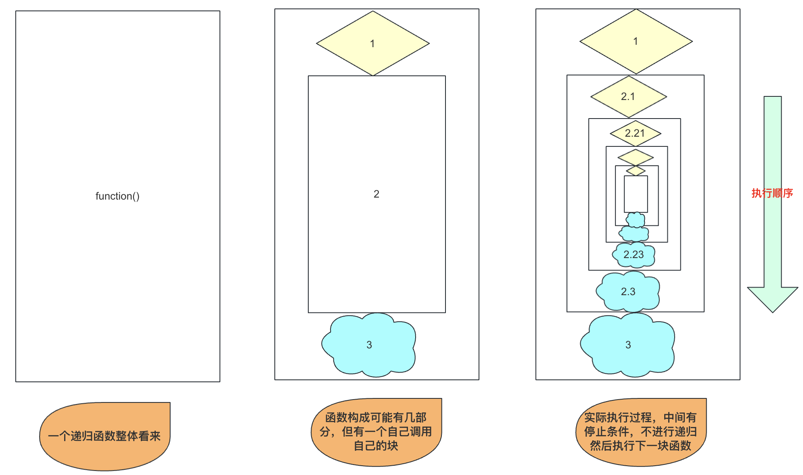
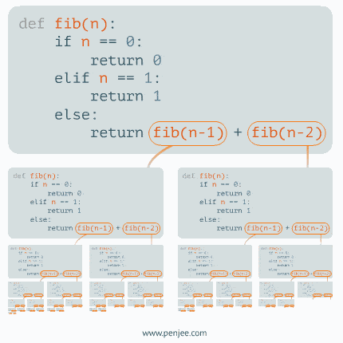
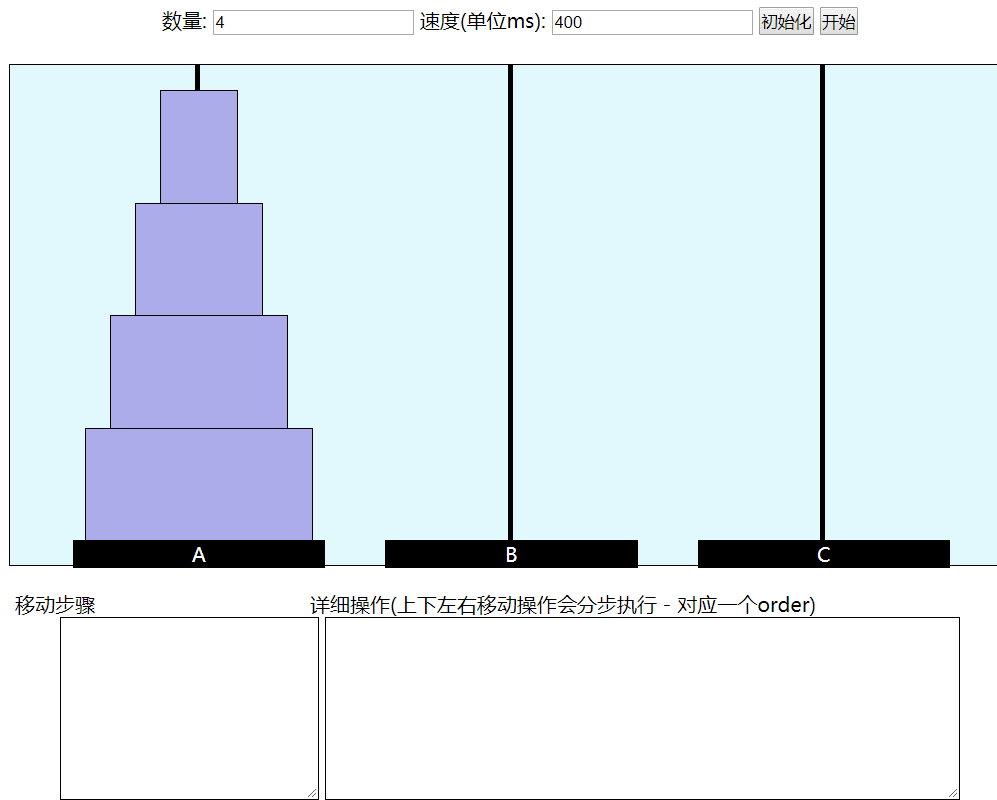
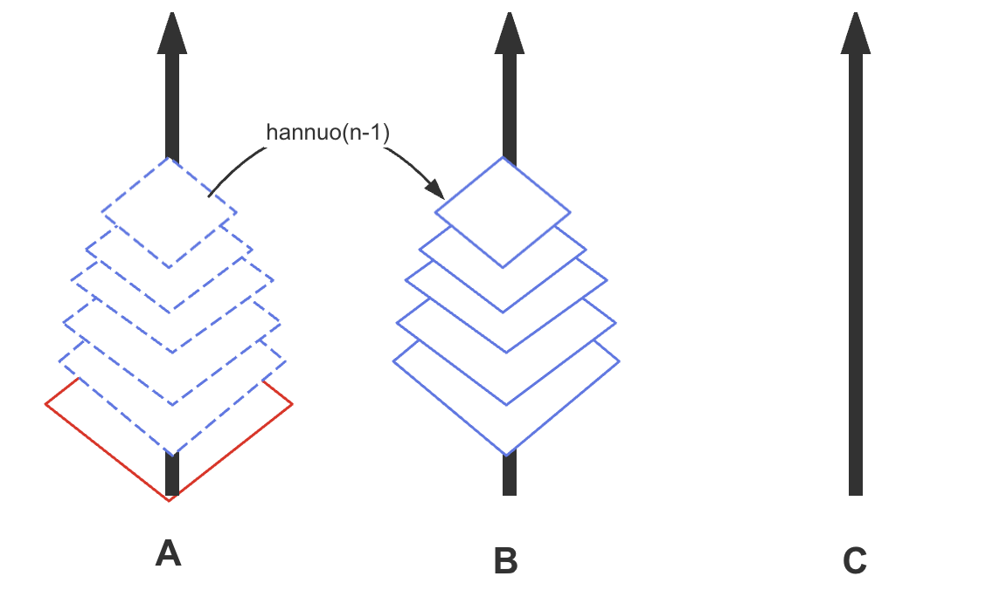
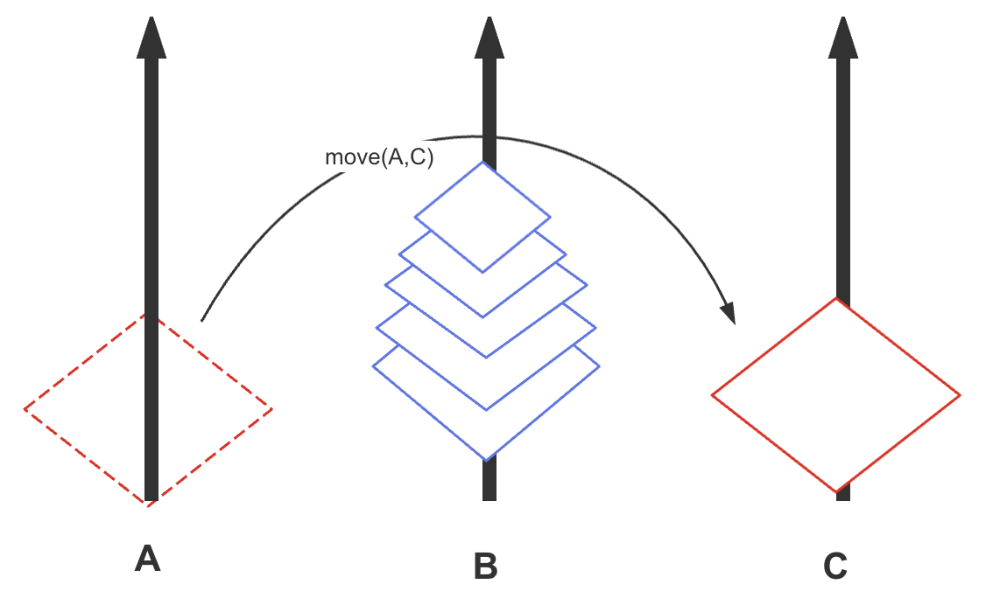
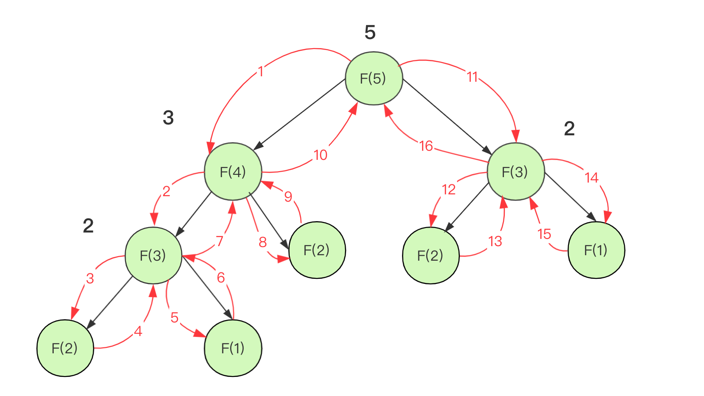
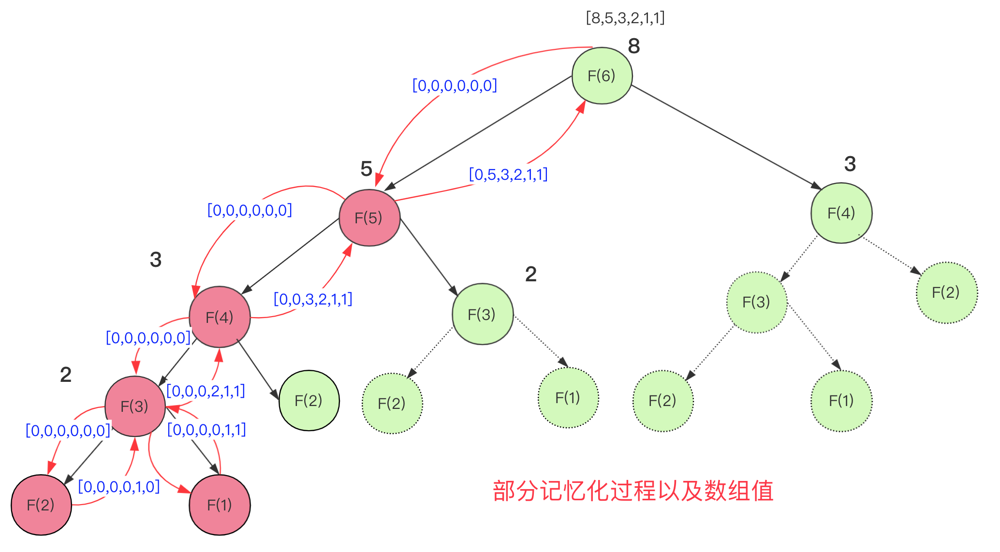
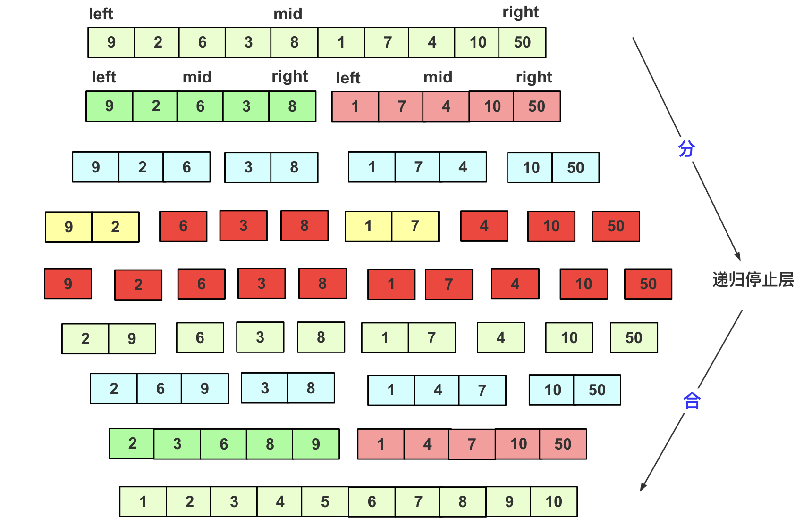

### 什么是递归

递归是学习算法入不入门的一个重要体现，很多重要的算法都借助递归，一定要搞懂递归思想流程！

递归：就是函数自己调用自己， 子问题须与原始问题为同样的事，或者更为简单。
递归通常可以简单的处理子问题，但是不一定是最好的解决方式。


对于递归一定要很清楚下面的一些特点：

- 递归是自己调用自己
- 递归通常不在意具体操作，只关心**初始条件**、**结束条件**和**上下层调用的关系**。
- 递归函数需要有**临界停止点(结束条件)**，即递归不能无限制的执行下去。通常这个点为必须经过的一个数。
- 递归可以被栈替代，有些递归可以记忆化优化，比如遇到重复性的可以借助空间内存记录而减少递归的次数

认识递归，递归函数通常看起来简易但是对于初学者可能很难去理解它，拿一个递归函数来说。

```java
void recursion()
{
	System.out.println("bigsai前");
	recursion();
	System.out.println("bigsai后");
}
```
这是一个递归嘛？不是正常递归，没有结束条件，自己一致调用自己导致无限循环。

那正确的递归应该这样

```java
void recursion(int time)
{
	if(time==0) {}//time==0不执行
	else {
		System.out.println("bigsai前time: "+time);
		recursion(time-1);
		System.out.println("bigsai后time: "+time);	
	}	
}
```
对于这样一种递归，它的流程大致是这样的

```
定义递归算法及参数
- 停止递归算法条件
- (可存在)其他前置逻辑
- 递归调用(参数需要改变)
- (可存在)其他后置逻辑
```



所以，调用recursion(5)在控制台输出是这样的


那么，我想你对递归函数执行的流程应该有所了解了吧。

### 递归求阶乘

初学递归，接触最多的就是递归求阶乘，为啥阶乘可以用递归来求呢? 我们首先看下阶乘，n的阶乘表示为：

`n!=n*(n-1)*……*1`

n的阶乘就是从1开始叠乘到n，那么n-1的阶乘为：

`(n-1)!=(n-1)*(n-2)*……*1`

通过观察就能知道n的阶乘和n-1的阶乘有这样的关系：

`n!=n*(n-1)!`

所以，我们要求n的阶乘，我们知道n-1的阶乘乘以n就可以得到，这就是最核心的关系。

0的阶乘为1，通过阶乘上下级的关系，我们假设一个函数factorial(n)为求n的阶乘的函数，那么这个函数为：

```java
int factorial(int n)
{
	if(n==0){//0的阶乘为1
		return 1;
	} else {
		return n*jiecheng(n-1);//return n*(n-1)*jiecheng(n-2)=-------
	}
}
```
运行流程为这样：


### 递归求斐波那契

斐波那契数列，已经跟随我们成长很久很久了，除了直接的斐波那契，爬楼梯等问题也和斐波那契问题差不多。

首先，求斐波那契的公式为：

`F[n]=F[n-1]+F[n-2](n>=3,F[1]=1,F[2]=1)`

也就是除了n=1和2特殊以外，其他均是可以使用递推式，按照上述递归思想，我们假设求斐波那契设成F(n)；

那么递推实现的代码为：

```java
long F(int n) {
	if(n==1||n==2) {return 1;}
	else {
		return F(n-1)+F(n-2);
	}
}
```
其实它的调用流程为：



不过这个斐波那契这样的求法效率并不高，后面会提一嘴。

### 递归解决汉诺塔

汉诺塔是经典递归问题：
>相传在古印度圣庙中，有一种被称为汉诺塔(Hanoi)的游戏。该游戏是在一块铜板装置上，有三根杆(编号A、B、C)，在A杆自下而上、由大到小按顺序放置64个金盘(如下图)。游戏的目标：把A杆上的金盘全部移到C杆上，并仍保持原有顺序叠好。操作规则：每次只能移动一个盘子，并且在移动过程中三根杆上都始终保持大盘在下，小盘在上，操作过程中盘子可以置于A、B、C任一杆上。


1. 如果A只有一个（A->C）
2. 如果A有两个（A->B）,(A->C),(B->C)
3. 如果A有三个（A->C）,(A->B),(C->B),(A->C),(B->A),(B->C),(A->C).
4. 如果更多，那么将会爆炸式增长。




可以发现每增加一步，其中的步骤会多很多，如果一步步想，很难想明白，所以要用递归全局的想法看问题。

当有1个要从A->C时，这里使用函数**move(A,C)**表示(其他move操作同理)。

用**hannuo(n)**函数表示总共n个盘子要从A->C。

递归，其实就是要找上下层的关系，n个盘子从A挪到C和n-1个盘子从A挪到C有啥联系即需要搞清楚hannuo(n)—>hannuo(n-1)有啥关系，下面带你一步步分析。

**假设有n个盘子**

第一步：hannuo(n-1)，n-1个盘子从A移到B，此时A还剩个最大的。



第二步：move(A,C)移动最大盘子A移到C，此时大的在C上




第三步：hannuo(n-1)，n-1个盘子从B移到C，此时完成平移。


是不是发现什么规律了，其实n和n-1之间的递推关系并不复杂，不过从A挪到C中间move用到B，所以参数要加上B，不过具体每个参数的含义自己定义即可。


这里定义hannuo(n,A,B,C)递归函数表示n个盘子从A移到C(B就是因为用到中间过渡所以传参一下)。然后只需要特殊定义一下n为1的情况，其他都满足上述描述的流程，可以动手画一画试一试。

经过上面分析，那么完整的操作为：

```java
public class Hanoi {
	static void move(char a,char b)
	{
		System.out.println("移动最上层的"+ a+ "到"+ b+ "\t");
	}
	static void hannuota(int n,char a,char b,char c){//主要分析每一大步对于下一步需要走的。
		if(n==1) {move(a,c);}//从a移到c
		else{
			hannuota(n-1,a,c,b);//将n-1个从a借助c移到b
			move(a,c); //将第n（最后一个）从a移到c。
			hannuota(n-1,b,a,c);//再将n-1个从b借助a移到c
		}
	}
	public static void main(String[] args)
	{
		hannuota(5,'a','b','c');
	}
}
```


### 递归 VS 记忆化

很多时候，递归的效率是很低的(一个递归拆分成两个及以上子问题效率就不太行了)，我们要用动态规划或者**记忆化**去优化，为什么要记忆化？因为递归成子问题，子问题再拆分成子问题，**造成很多的重复计算**！

比如上面说到的递归求斐波那契数列，就是一个效率非常低的算法，比如你看看F(5)是这样走的：



在递归求F(4)时候，F(4)递归会求解F(3)，但是右侧的还会再执行一遍。如果是数量非常大的数，那么将耗费很大的时间。所以我们就可以采取记忆化！第一次算出结果的时候就存储一下，如果是线性有规律(大部分)就用数组，否则就用HashMap存储。

具体实现的代码为:

```java
static long F(int n,long record[]){
  if(n==1||n==2) {return 1;}
  if(record[n]>0)
    return record[n];
  else
    record[n]=F(n-1,record)+F(n-2,record);
  return record[n];
}
public static void main(String[] args) {
  int n=6;
  long[] record = new long[n+1];
  System.out.println(F(n,record));
}
```

这样可以节省很多时间，尤其是n非常大的情况(递归是指数级别增长，记忆化是线性级别)。例如一个F(6)求解过程：




当然，记忆化的问题远远不止这么多，具体还需要自行学习，这里仅仅通过一个递归求斐波那契的优化让大家认识到记忆化的优势。


### 递归 VS 数据结构

递归在很多场景都有很好的应用，在链表中、二叉树、图中(搜索算法)都有很多的应用，这里就举一些非常经典的例子。

比如在链表中，很经典的就是链表逆序输出、链表反转问题，比如链表反转问题，对应力扣206(给你单链表的头节点 `head` ，请你反转链表，并返回反转后的链表)，可以这样巧妙的实现：

```java
/**
 * Definition for singly-linked list.
 * public class ListNode {
 *     int val;
 *     ListNode next;
 *     ListNode() {}
 *     ListNode(int val) { this.val = val; }
 *     ListNode(int val, ListNode next) { this.val = val; this.next = next; }
 * }
 */
class Solution {
    public ListNode reverseList(ListNode head) {
        if(head==null||head.next==null)
            return  head;
        ListNode node =reverseList(head.next);//返回最后的链表节点
        head.next.next=head;//后一个节点指向自己
        head.next=null;//自己next指向null 
        return node;
    }
}
```

对于二叉树，最经典的就是二叉树的前序、中序、后序遍历的递归实现方式：

例如二叉树前序遍历：

```java
public void qianxu(node t)// 前序递归 前序遍历：根结点 ---> 左子树 ---> 右子树
{
	if (t != null) {
		System.out.print(t.value + " ");// 当前节点
		qianxu(t.left);
		qianxu(t.right);
	}
}
```

二叉树中序遍历：

```java
public void zhongxu(node t)// 中序遍历 中序遍历：左子树---> 根结点 ---> 右子树
{
	if (t != null) {
		zhongxu(t.left);
		System.out.print(t.value + " ");// 访问完左节点访问当前节点
		zhongxu(t.right);
	}
}
```

二叉树的后序遍历：

```java
public void houxu(node t)// 后序遍历 后序遍历：左子树 ---> 右子树 ---> 根结点
{
	if (t != null) {
		houxu(t.left);
		houxu(t.right);
		System.out.print(t.value + " "); // 访问玩左右访问当前节点
	}
}
```

### 递归 VS 常见算法

在我们熟知很多算法都与递归有着很大关系。比如dfs深度优先遍历、回溯算法、分治算法等，这里只是简单介绍一下。

递归只是计算机执行一种方式，一个来回的过程，所以这个过程可以被一些算法很巧妙的运用。

**分治算法**：分治算法的基本思想是将原问题分解为若干个规模较小但结构与原问题相似的子问题，递归（一般用递归）地解决这些子问题，然后再合并其结果，得到原问题的解。常见的快排、归并排序都是使用分治算法，其算法实现借助递归实现。

例如归并排序其流程：

1. **分解（Divide）**：将待排序的数组分成两个子数组，分别对这两个子数组进行排序。
2. **解决（Conquer）**：递归地对两个子数组进行归并排序。
3. **合并（Combine）**：将排好序的两个子数组合并成一个有序数组。



算法实现为：

```java
private static void mergesort(int[] array, int left, int right) {
  int mid=(left+right)/2;
  if(left<right){
    mergesort(array, left, mid);
    mergesort(array, mid+1, right);
    merge(array, left,mid, right);
  }
}

private static void merge(int[] array, int l, int mid, int r) {
  int lindex=l;int rindex=mid+1;
  int team[]=new int[r-l+1];
  int teamindex=0;
  while (lindex<=mid&&rindex<=r) {//先左右比较合并
    if(array[lindex]<=array[rindex]){
      team[teamindex++]=array[lindex++];
    } else {				
      team[teamindex++]=array[rindex++];
    }
  }
  while(lindex<=mid) {//当一个越界后剩余按序列添加即可
    team[teamindex++]=array[lindex++];
  }
  while(rindex<=r){
    team[teamindex++]=array[rindex++];
  }	
  for(int i=0;i<teamindex;i++){
    array[l+i]=team[i];
  }
}
```


**dfs、回溯法** 通常想着枚举尽可能多的情况,很多时候我们并**不能很好知道运行界限**是在哪，这就是dfs和回溯解决的问题，所以我们可以写好限定条件使用递归去实现，递归的归过程也可很好的复原去进行其他试探。包过二叉树的前中后遍历都蕴涵dfs算法思想,而回溯算法则是经典全排列、八皇后问题代表。

其流程通常为：

```
定义回溯算法及参数
- (符合条件)跳出
- (不符合)不跳出：
- - 遍历需要操作的列表&&该元素可操作&&可以继续试探
- - - 标记该元素已使用以及其他操作
- - - 递归调用(参数改变)
- - - 清除该元素标记以及其他操作
```

此外，递归还在很多算法中有广泛的应用，这里就不具体列举啦！

### 结语

今天递归就讲到这里啦，学好递归没那么容易，还是要具体掌握各种算法、题目才能慢慢领略递归精髓，递归用好可以写出很多骚代码！

不过实际题目注重效率和便捷，不能盲目追求效率，也不能盲目使用递归不注意算法优化。
